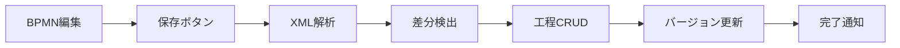
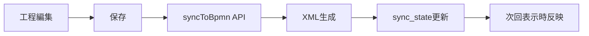

# BPMN双方向同期機能 使用ガイド

## 概要

Phase 9.1で実装されたBPMN-工程表の双方向同期機能により、以下が可能になりました：

1. **BPMN図を直接編集** → 工程表に自動反映
2. **工程表を編集** → BPMN図に自動反映
3. **バージョン管理**で競合を検知

---

## 使用方法

### 1. 工程表詳細ページでBPMNタブを開く

```
/projects/{projectId}/process-tables/{tableId}
```

「BPMNフロー図」タブをクリック

### 2. 表示モード vs 編集モード

#### 📊 **表示モード**（デフォルト）
- 工程表データから**自動生成**されたBPMN図を表示
- 読み取り専用
- 工程表を編集すると自動的に更新

#### ✏️ **編集モード**
- BPMN図を直接編集可能
- タスク、ゲートウェイ、イベントの追加・削除・移動
- 保存すると工程表に同期

**切り替え方法:**
- 「編集モードに切り替え」ボタンをクリック
- 編集完了後は「表示モードに切り替え」で戻る

---

## 編集モードでの作業フロー

### ステップ1: 編集モードに切り替え
```
[編集モードに切り替え] ボタンをクリック
```

### ステップ2: BPMN図を編集
- **タスク追加**: 左パレットから「Task」をドラッグ
- **接続**: タスクをクリック → 矢印アイコンで次のタスクに接続
- **プロパティ編集**: 要素をクリック → 右パネルで名前等を編集

### ステップ3: 保存
```
[保存] ボタンをクリック
```

**保存時の処理:**
1. BPMN XMLを解析
2. 工程表との差分を検出
3. 工程データを自動更新
4. バージョン番号をインクリメント

### ステップ4: 同期結果を確認
- トーストメッセージで成功/失敗を通知
- 「工程一覧」タブで更新された工程を確認

---

## 同期の仕組み

### BPMN → 工程表



**検出される変更:**
- タスクの追加/削除
- タスク名の変更
- 接続（beforeProcessIds）の変更
- レーン（スイムレーン）の変更

### 工程表 → BPMN



**自動反映タイミング:**
- 工程を追加/更新/削除した直後
- BPMNタブを開いた時

---

## バージョン管理と競合検知

### 楽観的ロック

```typescript
// 保存時にバージョンチェック
const currentVersion = syncState?.version || 0;

const result = await window.electronAPI.bpmnSync.syncToProcessTable({
  processTableId,
  bpmnXml: xml,
  version: currentVersion, // 期待するバージョン
});

if (!result.success && result.conflicts) {
  // 競合発生 → 最新データを再読み込み
  showToast('error', '他のユーザーが更新しています');
  await loadData();
}
```

### 競合が発生する場合

1. **ユーザーA**がBPMN編集中（version: 5）
2. **ユーザーB**が工程表を編集して保存（version: 6に更新）
3. **ユーザーA**が保存しようとする
4. バージョン不一致検出（期待: 5、実際: 6）
5. エラーメッセージ表示 + 最新データを再読み込み

---

## データベーステーブル

### `bpmn_sync_state`
同期状態を管理

| カラム | 型 | 説明 |
|--------|-----|------|
| id | TEXT | UUID |
| process_table_id | TEXT | 工程表ID（UNIQUE） |
| bpmn_xml | TEXT | 最新のBPMN XML |
| last_synced_at | INTEGER | 最終同期日時 |
| last_modified_by | TEXT | 'process' or 'bpmn' |
| version | INTEGER | バージョン番号 |
| created_at | INTEGER | 作成日時 |
| updated_at | INTEGER | 更新日時 |

### `sync_transactions`
同期履歴を記録（監査ログ）

| カラム | 型 | 説明 |
|--------|-----|------|
| id | TEXT | UUID |
| process_table_id | TEXT | 工程表ID |
| source | TEXT | 'process' or 'bpmn' |
| operation | TEXT | 'create', 'update', 'delete', 'reorder', 'move' |
| entity_type | TEXT | 'process', 'lane', 'gateway', 'edge', 'event' |
| entity_id | TEXT | エンティティID |
| changes | TEXT | 変更内容（JSON） |
| status | TEXT | 'pending', 'applied', 'failed', 'conflict' |
| error_message | TEXT | エラーメッセージ（失敗時） |
| created_at | INTEGER | 作成日時 |
| applied_at | INTEGER | 適用日時 |

---

## API仕様

### 1. 同期状態取得
```typescript
window.electronAPI.bpmnSync.getSyncState(processTableId: string)
  : Promise<BpmnSyncState | null>
```

### 2. BPMN → 工程表同期
```typescript
window.electronAPI.bpmnSync.syncToProcessTable({
  processTableId: string,
  bpmnXml: string,
  version: number,
}): Promise<SyncResult>
```

**SyncResult:**
```typescript
{
  success: boolean;
  conflicts?: Conflict[];
  updatedProcesses?: Process[];
  newVersion: number;
}
```

### 3. 工程表 → BPMN同期
```typescript
window.electronAPI.bpmnSync.syncToBpmn(processTableId: string)
  : Promise<void>
```

---

## トラブルシューティング

### Q1: 保存しても工程表が更新されない

**原因:** BPMN XMLのパース処理が未完成の可能性

**確認方法:**
1. ブラウザのDevToolsを開く（F12）
2. Consoleタブで `[BpmnSync]` のログを確認
3. エラーメッセージを確認

**対処:**
- `electron/ipc/bpmnSync.handlers.ts` の `parseBpmnXml()` を確認
- 現在は `<bpmn:task>` のみ対応（ゲートウェイ、イベントは未実装）

### Q2: 競合エラーが頻発する

**原因:** 複数ユーザーが同時編集している

**対処:**
1. 「表示モードに切り替え」で最新データを確認
2. 再度編集モードで編集
3. 保存前に他のユーザーと調整

### Q3: BPMN図が表示されない

**原因:** 工程データが未登録

**対処:**
1. 「工程一覧」タブで工程を追加
2. BPMNタブに戻る
3. 自動生成されたBPMN図が表示される

---

## 制限事項

### Phase 9.1での実装範囲

✅ **実装済み:**
- タスク（Task）の追加/削除/更新
- シーケンスフロー（接続）の管理
- スイムレーン（Lane）の基本対応
- バージョン管理と競合検知

⚠️ **部分実装:**
- ゲートウェイ（Gateway）- 型定義のみ
- イベント（Event）- 型定義のみ
- データオブジェクト - 別管理

❌ **未実装:**
- サブプロセス（SubProcess）
- メッセージフロー（MessageFlow）
- 複雑なゲートウェイロジック

---

## 今後の拡張予定

1. **Phase 9.2**: ゲートウェイとイベントの完全対応
2. **Phase 9.3**: サブプロセスとメッセージフロー
3. **Phase 10**: リアルタイム共同編集（WebSocket）

---

## 関連ドキュメント

- [Phase 9.1仕様書](./PHASE_9_1_BIDIRECTIONAL_SYNC.md)
- [BPMNエディタ実装](../src/components/bpmn/BpmnEditor.tsx)
- [同期ハンドラー](../electron/ipc/bpmnSync.handlers.ts)
